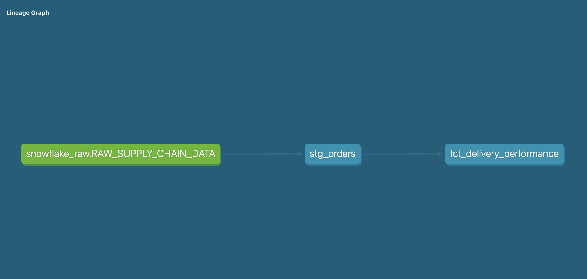

# 🚚 Supply Chain AI & Analytics Engineering Pipeline

An end-to-end production-style ELT pipeline and predictive engine built with **dbt**, **Snowflake**, and **Streamlit**.

## 🚀 Objective
Design and implement a modular analytics workflow that transforms raw transactional data into business-ready insights and predictive signals:
* **Ingest & Validate**: Processed a dataset of **180,519 items** across **164 countries**.
* **Medallion Architecture**: Implemented Bronze/Silver/Gold layers using dbt.
* **Predictive Power**: Deployed a Machine Learning model to identify high-risk deliveries with **56.22% confidence**.

## 🏗 Architecture



This project follows the **Medallion Architecture** to ensure data integrity and auditability.


* **🥉 Bronze (RAW)**: Immutable source data loaded into Snowflake.
* **🥈 Silver (STAGING)**: Data cleaning, type casting, and index correction for shifted columns.
* **🥇 Gold (MART)**: Final `fct_delivery_performance` table used for executive reporting.

## 🛠 Technology Stack
* **Cloud Warehouse**: Snowflake
* **Transformation**: dbt (Data Build Tool)
* **Intelligence**: Python 3.12 & Scikit-Learn (Random Forest)
* **Visualization**: Streamlit

## 🧪 Technical Challenges & Solutions
* **The "Zero Percent" Bug**: Initial reports showed 0% delays. By auditing the Snowflake RAW layer, I discovered a CSV column shift. I refactored the dbt logic to correctly align indices, revealing a true **51.69% average late rate**.
* **Predictive Modeling**: Engineered a pipeline to encode geographical data into numerical features, allowing the AI Predictor to flag risks before shipping.

## ⚙️ Setup and Installation

### 1. Environment Configuration
```bash
python -m venv supply-env
source supply-env/bin/activate
pip install -r requirements.txt